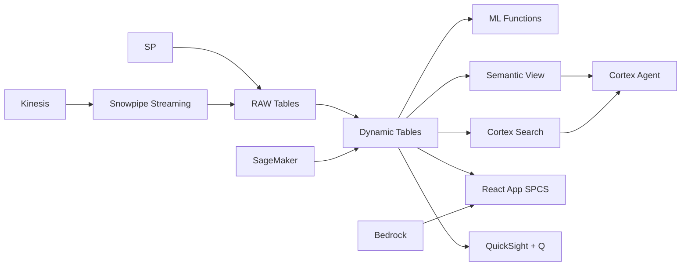

# Last-Mile Delivery Optimization & Geospatial Intelligence

Philippine archipelago logistics: 7,641 islands, 180M people — Snowflake uses H3 geospatial indexing to optimize last-mile delivery, ML.FORECAST to predict volumes, and Location Service integration for real-time routing intelligence.

## Architecture

The Philippines is the world's most complex last-mile delivery market: 7,641 islands, 180 million people, monsoon seasons, and incomplete addressing systems. A leading delivery company handles 3.2M parcels monthly but loses ₱450M annually to failed deliveries — returned to hub, rider overtime, and customer refunds. Traditional route planning tools don't understand archipelago geography. H3 geospatial + ML.FORECAST does.



## Snowflake Capabilities

| Capability | Implementation |
|-----------|---------------|
| Dynamic Tables | ZONE_PERFORMANCE / RIDER_UTILIZATION / DEMAND_FORECAST_INPUT / FAILED_DELIVERY_ANALYSIS |
| ML Functions | ML.FORECAST + ML.CLASSIFICATION |
| Cortex AI | COMPLETE, AI_CLASSIFY |
| Cortex Search | 4100000 documents indexed |
| Cortex Agent | LOGISTICS_INTELLIGENCE_AGENT |
| Semantic View | DELIVERY_ANALYTICS |
| React App (SPCS) | 5 tabs + DemoGuide |


## AWS Services

| Service | Role in Demo |
|---------|-------------|
| Amazon Location Service | Real-time rider GPS tracking and geofencing |
| Amazon Kinesis | Stream delivery events and GPS coordinates |
| Amazon SageMaker | Delivery volume forecasting model |
| Amazon Bedrock (Claude) | Generate zone optimization reports |
| Amazon QuickSight + Q | Logistics operations dashboard with maps |
| AWS Step Functions | Orchestrate daily planning workflows |


## Personas

| Persona | Role | Key Questions |
|---------|------|---------------|
| **Ricardo Jose Villar** | VP Logistics & Fulfillment | "Which delivery zones have the worst success rates?" "What's our average cost per parcel by region?" |
| **Ana Patricia Dimaculangan** | Route Optimization Manager | "Which H3 hexagons have the lowest delivery density?" "What's the predicted volume for Cebu hub next week?" |


## Data

| Table | Rows | Description |
|-------|------|-------------|
| DELIVERY_HUBS | 85 | Fulfillment hubs and micro-hubs across Philippines |
| PARCELS | 3,200,000 | 60 days of parcel records with delivery status |
| RIDERS | 12,000 | Delivery riders (motorcycle, van, bike) |
| DELIVERY_ATTEMPTS | 4,100,000 | Individual delivery attempts with GPS coordinates |
| LOCATION_DATA | 8,500,000 | AWS Location Service tracking points |
| DEMAND_HISTORY | 180,000 | Daily delivery volumes by zone for forecasting |


## Build Instructions

### Prerequisites
- Snowflake account with ACCOUNTADMIN access
- Cortex AI enabled (ML Functions, Search, Agent)
- Warehouse: LOGISTICS_WH (Medium)
- AWS CLI with access (us-west-2)

### Deployment

```bash
snowsql -f snowflake/00_setup.sql
snowsql -f snowflake/01_marketplace_install.sql
snowsql -f snowflake/02_raw_tables.sql
snowsql -f snowflake/03_staging.sql
snowsql -f snowflake/04_dynamic_tables.sql
snowsql -f snowflake/05_search.sql
snowsql -f snowflake/06_ml_models.sql
snowsql -f snowflake/07_semantic_view.sql
snowsql -f snowflake/08_agent.sql
```

### React App (SPCS)
```bash
cd app && npm ci && npm run build
docker build -t aws-philippines-retail-delivery-app .
docker push bdiqc8sm-default.registry.snowflakecomputing.com/delivery_logistics/app/aws_philippines_retail_delivery/app:latest
```

### Demo Mode
Open the app URL with `?demo=true` for presenter view.

## Build Modes

### Snowflake Only
Run scripts 00-08 (skip AWS-specific integration). Uses:
- **H3 geospatial functions (native)** instead of Amazon Location Service
- **Snowpipe Streaming SDK** instead of Amazon Kinesis
- **ML.FORECAST (native)** instead of Amazon SageMaker
- **Cortex Complete** instead of Amazon Bedrock (Claude)
- **Snowflake Intelligence (Cortex Analyst)** instead of Amazon QuickSight + Q
- **Task Graphs (DAG orchestration)** instead of AWS Step Functions

### Full AWS + Snowflake
Run all scripts including AWS integration. Deploy QuickSight dashboard from `quicksight/`.

## Business Impact

Industry research and Snowflake customer outcomes:
- **Philippine e-commerce logistics market reached $4.8B in 2023** — [Ken Research](https://www.kenresearch.com/industry-reports/philippines-logistics-market)
- **Failed deliveries cost Philippine e-commerce ₱28B annually (returns + redelivery)** — [DTI Philippines](https://www.dti.gov.ph/negosyo/e-commerce/)
- **H3 geospatial optimization reduces delivery costs 15-25% in complex geographies** — [Uber Engineering](https://www.uber.com/en-PH/blog/h3/)
- **Demand forecasting improves fleet utilization 20-30% during peak periods** — [McKinsey Logistics](https://www.mckinsey.com/industries/travel-logistics-and-infrastructure/our-insights)


## Key Demo Numbers

- **3.2M parcels** delivered monthly across 85 hubs
- **14 zones** below 85% delivery success rate
- **4,200 zones** H3 hexagonal delivery areas monitored
- **340% volume spike** predicted for 11.11 sale event
- **₱450M** annual cost of failed deliveries
- **12,000 riders** tracked via Location Service GPS


## License

Apache 2.0 — See [LICENSE](LICENSE) for details.

This is a personal demo project and is not an official Snowflake offering. It comes with no support or warranty.